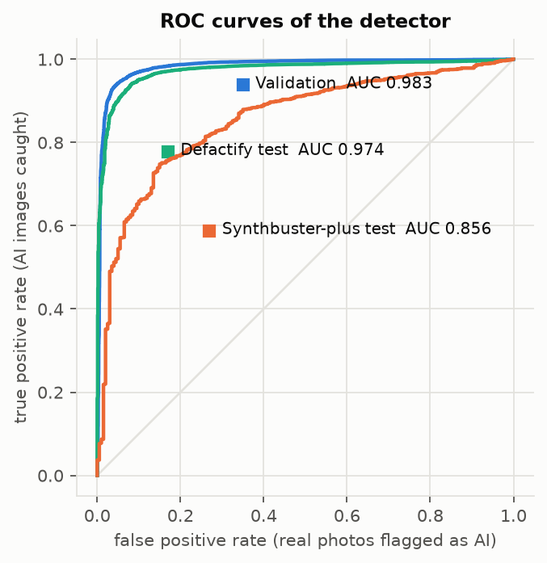
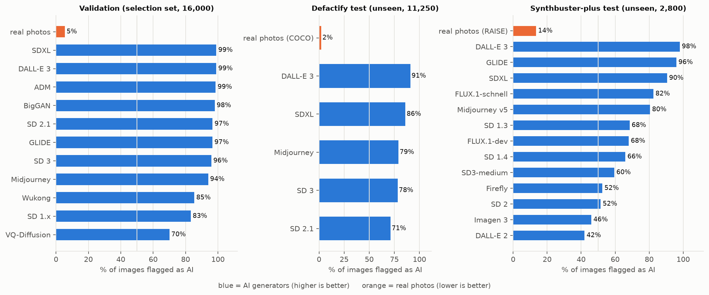

# AI Image Analyzer

**Detect AI-generated images and see what the decision rests on.** A Python library (and CLI) that combines a trained
neural detector with an exact, model-grounded explanation, a generator-attribution model that knows when to abstain,
an optional image description, and a set of classical forensic measurements — all running on ONNX Runtime, **no PyTorch required**.

> **Status: alpha (v0.2).** It works end to end and is honest about its limits, but it is **not a reliable detector for
> arbitrary images**. On generators and image pipelines unlike its training data it is right about 70% of the time, and some
> real photos are flagged as AI. Read [Limitations](#limitations) before relying on any output.
> The full analysis behind every number here is in **[docs/REPORT.md](docs/REPORT.md)**.

| | |
|---|---|
| Detector | EfficientNet-B0, 192 px, 15 MB ONNX · trained on 70,000 images (11 generators + real) |
| Attribution | EfficientNet-B0, 11 generators, abstains below 80% confidence · 15 MB ONNX |
| Explanation | exact per-region evidence map of the detector's own decision (`--heatmap`) |
| Weights | bundled in the package · also on Hugging Face: [`ShayonSarker/ai-image-analyzer-weights`](https://huggingface.co/ShayonSarker/ai-image-analyzer-weights) |
| License | code MIT · weights CC BY-NC-SA 4.0 ([why](LICENSE-WEIGHTS.md)) |

## Install

```bash
pip install git+https://github.com/Dadhichi-Sarker-Shayon/AI-Generated-Image-Analyzer.git
# optional: natural-language image descriptions (downloads a ~1 GB captioning model on first use)
pip install "ai-image-analyzer[describe] @ git+https://github.com/Dadhichi-Sarker-Shayon/AI-Generated-Image-Analyzer.git"
```

From a clone: `pip install -e .` (add `.[describe]`, `.[train]` or `.[ml]` as needed). Python ≥ 3.10.

## Quick start

```python
from ai_image_analyzer import AIImageAnalyzer

analyzer = AIImageAnalyzer(use_clip=False)          # bundled ONNX detector + attributor, CPU
report = analyzer.analyze("photo.jpg")              # path, Path, bytes, numpy array or PIL image

print(report.verdict, f"{report.ai_probability:.1%}")      # likely_ai 82.2%
print(report.attribution.specific_model)                   # Stable Diffusion 3 (confidence 88%)  - or "not confidently attributable"
print(report.to_markdown())                                # full human-readable report
report.model_evidence                                      # per-region evidence of the detector (dict)
```

```bash
ai-image-analyzer photo.jpg                       # markdown report
ai-image-analyzer photo.jpg --json                # machine-readable
ai-image-analyzer photo.jpg --heatmap evidence.png    # where the model found its evidence
ai-image-analyzer photo.jpg --describe            # + one-sentence description (needs the [describe] extra)
cat photo.jpg | ai-image-analyzer - --json        # stdin
```

Options: `use_trained=False` (heuristics only), `binary_checkpoint="my.onnx"` (your own `.onnx`/`.pt`),
`use_attribution=False`, `explain_model=False`, `describe=True`, `trained_device="cuda"`. About 0.3 s per image on CPU.

## What you get in a report

1. **Verdict and probability** from the trained detector (`likely_ai`, `likely_natural`, or `inconclusive` in the uncertain band).
2. **Where the model found its evidence** — the detector averages features and applies one linear layer, so its score splits
   *exactly* into one contribution per image region (`sum(evidence) + bias = logit`, verified at export). Red = pushes toward AI,
   blue = toward natural. Typically the evidence is spread over the whole image (global texture/statistics), not one hotspot, and
   the report says so instead of inventing one. Details and proof: [report §7](docs/REPORT.md).
3. **Generator attribution** — which of 11 generators (ADM, BigGAN, DALL-E 3, GLIDE, Midjourney, SD 1.x/2.1/3/XL, VQ-Diffusion,
   Wukong) it most resembles, **only when confident**. Otherwise it says "not confidently attributable". Never run for images judged natural.
4. **Classical forensic measurements** (spectrum, lattice, noise, texture, color, JPEG) shown with their values *and how often
   each fires on real vs AI images* (measured). On our benchmarks none of them separates the classes, so they are listed as
   measurements, **not as evidence**.
5. **Optional description** of the image content (not evidence about AI generation).

<details><summary>Example JSON (abridged)</summary>

```json
{
  "ai_probability": 0.822,
  "verdict": "likely_ai",
  "attribution": {"method": "trained", "family": "diffusion", "specific_model": "Stable Diffusion 3 (confidence 88%)",
                  "top_generators": [["sd3", 0.883], ["wukong", 0.037], ["sd21", 0.022]]},
  "findings": [
    {"code": "TRAINED_MODEL", "value": "P(AI)=0.901", "severity": "strong"},
    {"code": "MODEL_EVIDENCE_MAP", "value": "36/36 regions lean AI; top-3 regions hold 16% of the AI evidence"},
    {"code": "FFT_LATTICE", "validated": false, "measured_ai_rate": 1.0, "measured_real_rate": 1.0}
  ],
  "model_evidence": {"method": "class_activation_decomposition", "localized": false, "top_share": 0.156, "evidence": [[...6x6...]]}
}
```
</details>

## Results

Detector accuracy at threshold 0.5 (AUC and 95% bootstrap CI in the report). **The first row was used to pick the best epoch
and is optimistic; the unseen rows are the honest numbers.**

| Benchmark | Images | AUC | Accuracy | Real kept real | AI caught |
|---|---|---|---|---|---|
| Validation (selection set) | 16,000 | 0.983 | 94.5% | 94.6% | 94.5% |
| **Defactify test** (unseen; SD 2.1, SDXL, SD3, DALL-E 3, Midjourney vs COCO) | 11,250 | **0.974** | **83.9%** | 97.8% | 81.1% |
| **Synthbuster-plus test** (unseen; 13 generators incl. FLUX, Imagen 3, Firefly; real = RAISE camera raws) | 2,800 | **0.856** | **70.6%** | 86.5% | 69.3% |





Attribution: 78% correct on unseen images from the training pipeline, **47.5% on a different benchmark**; at its shipped 0.80
confidence it answers ~26% of images with 87% precision and still names ~12% of images from generators it has never seen
(FLUX is called "Stable Diffusion 3"). See [report §9](docs/REPORT.md).

## Limitations

- **Generalization is the main weakness.** Detection drops from 94% (seen generators) to 71% (new generators/pipeline).
  DALL-E 2 (42%), Imagen 3 (46%), SD 2 (52%), Firefly (52%) and SD3-medium (60%) are mostly missed on Synthbuster-plus; DALL-E 3 (98%) is caught.
- **False positives.** 13.5% of RAISE raw-camera photos are flagged as AI. At a 1% false-positive rate the detector catches only
  9% of Synthbuster-plus AI images (70% on Defactify). Do not use a single flag to accuse anyone.
- **Format/processing sensitivity.** The same photo scores 0.20 as JPEG, 0.27 as WebP and 0.16 as grayscale. Heavy compression,
  resizing, screenshots and social-media re-encoding were not systematically evaluated.
- **No parameter-value explanation exists.** ~50 interpretable statistics (spectral slope, noise sigma, texture entropy, residual
  kurtosis, ...) were tested on a controlled crop across two benchmarks; none separates AI from real consistently (cross-benchmark
  AUC ≈ 0.5). The library therefore does not claim that any measured value "proves" AI origin.
- **Attribution is closed-set and weak** across pipelines; it cannot name FLUX, Imagen, Firefly or any generator outside its 11 classes.
- Input is center-cropped and downscaled to 192 px, so fine pixel-level artifacts are largely discarded (trade-off for a 4 GB GPU).
- Benchmarks are small and two of the three share generators with training data; thresholds (e.g. attribution 0.80) were chosen on
  benchmark tables. Treat all numbers as indicative.
- Not evaluated against adversarial attacks. Detection of *edited/inpainted* real photos is out of scope.

## Repository layout

```
src/ai_image_analyzer/
  analyzer.py            AIImageAnalyzer facade
  detectors/             onnx_detector.py (bundled model), onnx_attribution.py, trained.py (torch .pt), heuristic detectors
  explain/               model_evidence.py (exact evidence map), findings.py (+ finding_stats.json), report.py
  attribution.py         generator attribution (trained) + legacy heuristic
  description.py         optional BLIP captioner
  models/weights/        detector_v2.onnx, attribution_v1.onnx (+ json sidecars)
scripts/                 data download/prep, training, evaluation, calibration, report assets (see docs/REPORT.md)
docs/REPORT.md           the full analysis report;  docs/figures/  charts;  docs/validation/  metric & attribution analysis
results/                 evaluation outputs, per-image probabilities, training logs, raw measurements
tests/                   49 tests
```

## Reproduce everything

```bash
pip install -e ".[train]"
python scripts/fetch_hf_datasets.py                       # Defactify + Tiny-GenImage (~11 GB)
python scripts/build_dataset.py                           # uniform crop/resize/JPEG -> C:\ai_data\detector
bash scripts/train_resilient.sh                           # detector (auto-resumes after GPU driver resets)
bash scripts/train_attribution.sh                         # attribution
python scripts/eval_external.py --ckpt checkpoints_v2/detector_v2.pt --parquet-glob "<synthbuster>/data/test-*.parquet" ...
python scripts/make_report_assets.py                      # rebuild all tables and figures
python scripts/export_onnx.py --detector-checkpoint checkpoints_v2/detector_v2.pt --out detector.onnx
```

Step-by-step commands, hardware (GTX 1650, 4 GB) and timings are in the [report](docs/REPORT.md#reproduction).

## Configuration, ONNX, Docker

Forensic thresholds live in `configs/detector_config.yaml` (`AIImageAnalyzer(config="my.yaml")`). `scripts/export_onnx.py` exports a
trained detector (verifying ONNX vs PyTorch outputs and the exactness of the evidence decomposition) or the CLIP vision encoder.
`docker build -t ai-image-analyzer .` then `docker run --rm -v $(pwd)/images:/images ai-image-analyzer /images/test.jpg --json`.

## Roadmap to beta

More diverse training data (FLUX, Imagen, Firefly, current Midjourney; varied resolution and compression), robustness evaluation
(JPEG/resize/screenshot), higher-resolution input, calibrated probabilities, a stronger attribution model, and a larger real-photo
benchmark to measure false-positive rates properly.

## License and credits

Code: [MIT](LICENSE). Weights: [CC BY-NC-SA 4.0](LICENSE-WEIGHTS.md). Datasets, models and papers this builds on: [NOTICE.md](NOTICE.md).
