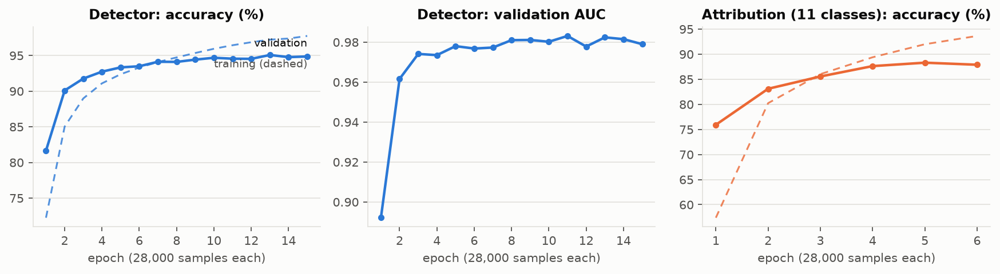
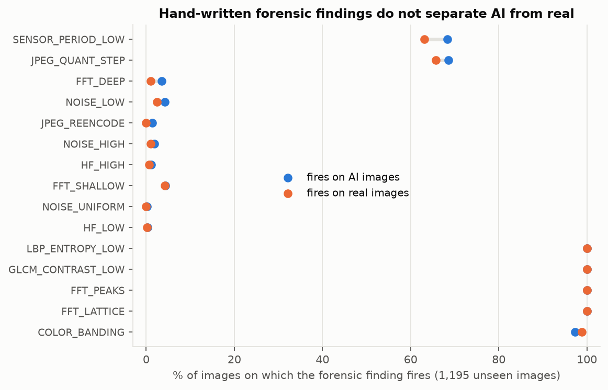
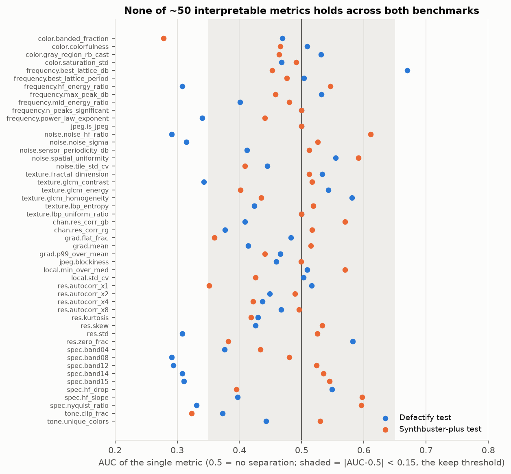
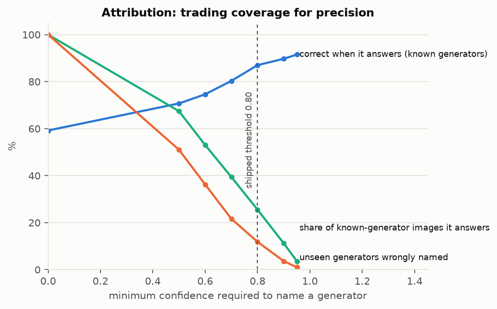

# AI Image Analyzer — Analysis Report (v0.2 alpha)

*Everything in this report was produced by the code in this repository on a single laptop (GTX 1650 4 GB, 7.4 GB RAM, Windows 11).
Tables and figures are regenerated from the files in [`results/`](../results) by `scripts/make_report_assets.py`; nothing below is typed in
from memory except where a number is quoted from a script's printed output, which is then saved under `results/` or `docs/validation/`.*

## Contents

1. [Summary](#1-summary)
2. [Goal and system overview](#2-goal-and-system-overview)
3. [Data](#3-data)
4. [Detector: training](#4-detector-training)
5. [Detector: evaluation](#5-detector-evaluation)
6. [The classical heuristic detectors](#6-the-classical-heuristic-detectors)
7. [Explaining the decision](#7-explaining-the-decision)
8. [Is there a human-readable "these values mean AI" rule?](#8-is-there-a-human-readable-these-values-mean-ai-rule)
9. [Generator attribution](#9-generator-attribution)
10. [Image description](#10-image-description)
11. [Library validation](#11-library-validation)
12. [Engineering log: what went wrong and what we fixed](#12-engineering-log-what-went-wrong-and-what-we-fixed)
13. [Limitations and threats to validity](#13-limitations-and-threats-to-validity)
14. [Reproduction](#reproduction)
15. [Roadmap to beta](#15-roadmap-to-beta)

---

## 1. Summary

**What was built.** A Python library and CLI that (a) classifies an image as AI-generated or natural with a trained EfficientNet-B0,
(b) explains the decision with an exact per-region evidence map of that same network, (c) names the likely generator
when — and only when — a second classifier is confident, (d) optionally describes the image content, and (e) reports classical
forensic measurements with their *measured* reliability. Both models are bundled as ONNX files (15 MB each) and run on ONNX Runtime
without PyTorch. Weights are also published on Hugging Face.

**Headline results** (threshold 0.5; 95% confidence intervals in §5):

| Benchmark | Images | AUC | Accuracy | Real kept real | AI caught |
|---|---|---|---|---|---|
| Validation (used to pick the epoch → optimistic) | 16,000 | 0.983 | 94.5% | 94.6% | 94.5% |
| Defactify test — *unseen*, 5 generators vs COCO | 11,250 | **0.974** | **83.9%** | 97.8% | 81.1% |
| Synthbuster-plus test — *unseen*, 13 generators vs RAISE | 2,800 | **0.856** | **70.6%** | 86.5% | 69.3% |

**Key findings**

1. The detector works well on generators/pipelines like its training data and degrades on new ones (94% → 84% → 71%).
   FLUX.1-schnell is caught 82% of the time, DALL-E 3 98%, but DALL-E 2 only 42% and Imagen 3 46%.
2. **The 15 hand-written forensic findings carried by the original library do not separate AI from real images** (§6, §8). Four fire on
   100% of both classes. About 50 interpretable statistics were then tested on a size-controlled crop across two benchmarks; none held up
   (cross-benchmark AUC ≈ 0.5). There is no valid numeric "this value means AI" rule to report, and the library no longer implies one.
3. The honest "why" is the detector's own arithmetic: its score decomposes **exactly** into per-region contributions. Strong AI
   verdicts are supported by almost every region — a global texture signal, not a local artifact.
4. Generator attribution generalizes poorly (78% on the training pipeline, 47.5% on another) and is confidently wrong on unseen generators
   about 12% of the time at the shipped threshold, so it abstains on ~74% of images.
5. Several bugs that inflated or distorted earlier results were found and fixed (§12), including a validation number that was
   optimistic, texture findings that fired on every image because the metrics behind them were switched off, and a library that
   silently fell back to weak heuristics on a bad path.

**Not ready for:** judging individual images with consequences, moderation at scale, or any claim of "reliable AI detection".
Appropriate for: research, education, and as one weak signal among several.

---

## 2. Goal and system overview

The project started as a heuristic forensic toolkit (FFT/noise/texture/JPEG metrics with hand-set thresholds) whose aim was to
**detect AI-generated images and explain exactly why**. This report documents the second stage: replacing the weak decision logic with
trained models, validating every claim the explanation makes, and packaging the result.

```
image ──► SignalAnalyzer (FFT, noise, texture, color, JPEG measurements; optional extra stats)
      ├─► OnnxBinaryDetector  (center-crop → 256 px → JPEG q95 → 192 px → EfficientNet-B0)
      │        ├─ P(AI) ───────────────► ensemble (trained model weight 4; heuristics 0.3; patch_cnn 0) ─► verdict
      │        └─ evidence map (6×6) ──► "where the model found its evidence" + heatmap
      ├─► OnnxGeneratorAttributor (same preprocessing; 11 classes; abstains < 0.80) ─► "likely generator" or "not attributable"
      ├─► ImageDescriber (optional BLIP captioner) ─► description
      └─► findings (values + measured fire rates on real vs AI)
```

Design rules adopted along the way: every claim in the report must be backed by a measurement on unseen images; models that cannot be
trusted must abstain or say so; a feature that fails validation is demoted, not hidden.

---

## 3. Data

### 3.1 Sources

| Dataset | Role | Content | License |
|---|---|---|---|
| Defactify Image Dataset (HF `Rajarshi-Roy-research/Defactify_Image_Dataset`) | train (42,000), validation (9,000), **test (11,250 of 45,000 used)** | MS COCO real images vs SD 2.1, SDXL, SD3, DALL-E 3, Midjourney v6 (COCO captions as prompts) | not declared |
| Tiny-GenImage (HF `TheKernel01/Tiny-GenImage`) | train (28,000), validation (7,000) | ImageNet real vs ADM, BigGAN, GLIDE, Midjourney, SD1.x, VQDM, Wukong | CC BY-NC-SA 4.0 |
| Synthbuster-plus (HF `marco-willi/synthbuster-plus`) | **test only (2,800)** | RAISE raw-camera real vs 13 generators incl. FLUX.1 dev/schnell, SD3-medium, Imagen 3, Firefly, DALL-E 2/3, Midjourney v5, SD 1.3/1.4/2/XL, GLIDE | not declared |

Combined training set: **70,000 images (21,000 real, 49,000 AI)**; validation **16,000 (5,000 real, 11,000 AI)**.

| Generator | Train | Val | | Generator | Train | Val |
|---|---|---|---|---|---|---|
| real | 21,000 | 5,000 | | SD 2.1 | 7,000 | 1,500 |
| Midjourney | 9,000 | 2,000 | | SD 3 | 7,000 | 1,500 |
| DALL-E 3 | 7,000 | 1,500 | | ADM, BigGAN, GLIDE, SD 1.x, VQ-Diffusion, Wukong | 2,000 each | 500 each |
| SDXL | 7,000 | 1,500 | | | | |

The test sets share generators with training for some classes (SD, DALL-E 3, Midjourney, GLIDE) but are different images, produced
and packaged by different people. Synthbuster-plus additionally contains generators never seen in training (FLUX, Imagen 3, Firefly, DALL-E 2).

### 3.2 Uniform preprocessing (and why)

Real and AI images in these datasets differ in format, size and compression, which a network can exploit instead of learning generation
artifacts. To remove the cheapest shortcuts, **every image** (training and test, real and AI) goes through the same pipeline:
center-crop to a square → resize to 256 px (Lanczos) → JPEG quality 95 → (at load time) resize to 192 px → ImageNet normalization.
The pipeline is implemented in `scripts/build_dataset.py` and mirrored exactly at inference (`OnnxBinaryDetector.preprocess`).
Cost: fine pixel-level detail is discarded; benefit: the model cannot separate classes by file type or resolution.

Shortcuts that remain: dataset-specific content (COCO scenes vs ImageNet objects), aspect-ratio/crop effects, and
generator-specific style. Whole-image size alone separates the classes only moderately (AUC of log-pixels: Defactify 0.63, Synthbuster 0.54;
file size: 0.60 and 0.66), but metrics that depend on size can still be misled — see §8.

---

## 4. Detector: training

| | |
|---|---|
| Model | `efficientnet_b0` (timm), ImageNet-pretrained, 2-class head, 192×192 input, 4.0 M parameters |
| Optimizer | AdamW, lr 1e-4, weight decay 1e-4; cosine decay over 20 epochs (the 1-epoch warm-up factor evaluates to 1.0, i.e. effectively no warm-up) |
| Batch | 16 × 2 gradient-accumulation steps = 32; mixed precision (fp16 + GradScaler) |
| Loss | cross-entropy with label smoothing 0.1 |
| Sampling | class-balanced `WeightedRandomSampler` (with replacement); **28,000 samples per "epoch"** so checkpoints are frequent |
| Augmentation | resize, horizontal flip, color jitter (brightness/contrast/saturation 0.2, hue 0.1). *The `--use-randaugment` flag in `train.py` is accepted but not implemented — it was passed during training and had no effect (to fix before beta).* No MixUp/CutMix. |
| Stopping | early stopping on validation AUC, patience 4 → stopped after epoch 15; best epoch 11 (val AUC 0.9831) |
| Compute | ~5–6 it/s on a GTX 1650; ~7.5 min/epoch including validation; ≈ 2 h total |



Training accuracy keeps rising (97.7%) while validation accuracy plateaus near 95% from epoch ~8: the model starts to fit the training
distribution rather than generalize. Per-epoch numbers: [`results/logs/training_detector.csv`](../results/logs/training_detector.csv).

The first run crashed 13 minutes in with a native CUDA error at the same moment Windows logged an NVIDIA driver (`nvlddmkm`) event
(GPU driver reset under sustained load). Training was made resilient: short epochs with a checkpoint each, a correct resume (restores the
LR schedule and early-stopping counter) and a wrapper that relaunches after a crash (`scripts/train_resilient.sh`). The final run
completed without further crashes.

---

## 5. Detector: evaluation

Protocol: for each benchmark, every image is preprocessed as in §3.2 and scored; threshold 0.5 unless stated. AUC and accuracy
confidence intervals are 95% bootstrap intervals. Per-image probabilities are saved in `results/probs_*.csv`.

| Benchmark | Images | AUC (95% CI) | Accuracy @0.5 (95% CI) | Real kept real | AI caught |
|---|---|---|---|---|---|
| Validation (selection set, 16,000) | 16,000 | 0.983 (0.981–0.985) | 94.5% (94.1%–94.9%) | 94.6% | 94.5% |
| Defactify test (unseen, 11,250) | 11,250 | 0.974 (0.970–0.977) | 83.9% (83.3%–84.6%) | 97.8% | 81.1% |
| Synthbuster-plus test (unseen, 2,800) | 2,800 | 0.856 (0.832–0.877) | 70.6% (68.9%–72.1%) | 86.5% | 69.3% |

**Operating points** — true-positive rate when the threshold is set to hit a given false-positive rate on that benchmark's real photos:

| Benchmark | TPR @ FPR 1% | TPR @ FPR 5% | TPR @ FPR 10% |
|---|---|---|---|
| Validation | 76.1% | 94.2% | 97.0% |
| Defactify test | 70.0% | 90.0% | 95.0% |
| Synthbuster-plus test | 8.7% | 54.5% | 65.9% |


### 5.1 The validation number is optimistic

The 94.5% validation accuracy was used to choose the best epoch, and the validation set mixes in the easy Tiny-GenImage
generators (ADM, BigGAN, GLIDE: 97–99% caught). On the Defactify test set — the same five generators the model saw, but unseen images —
accuracy is 83.9%. An earlier draft of the README quoted 94.6% as "held-out"; that was corrected. The honest headline is the unseen rows.

### 5.2 Detection rate by generator


**Defactify test** (real photos = false-positive rate): DALL-E 3 90.9%, SDXL 86.1%, Midjourney 79.1%, SD 3 78.3%, SD 2.1 71.1%; COCO real 2.2%.

**Synthbuster-plus test:** DALL-E 3 98.0%, GLIDE 96.0%, SDXL 90.5%, **FLUX.1-schnell 82.5%**, Midjourney v5 80.5%, SD 1.3 68.5%,
**FLUX.1-dev 68.0%**, SD 1.4 66.0%, SD3-medium 59.5%, Firefly 52.5%, SD 2 51.5%, **Imagen 3 46.0%**, **DALL-E 2 42.0%**; RAISE real 13.5% flagged.
Full tables for all three benchmarks: [`results/tables.md`](../results/tables.md).

Observations:
- Generators present in training are not uniformly easy: SD 2.1 is 97% on validation but 71% (Defactify) / 52% (Synthbuster "SD 2"),
  SD3 96% → 78% / 60%. The model partly keys on the dataset's image statistics, not only on the generator.
- Performance on unseen generators is generator-specific, not uniformly poor: FLUX.1-schnell (82%) is caught better than SD 1.x (66–68%) that
  *was* in training. Newer high-fidelity generators (Imagen 3, Firefly) are the hardest.
- The real-photo false-positive rate depends strongly on the real-photo domain: 2.2% on COCO, 5.4% on the (COCO+ImageNet) validation set,
  **13.5% on RAISE raw-camera photos**. Only 200 RAISE images exist in the test set, so the 13.5% is imprecise.

### 5.3 Sensitivity to format and processing (small checks)

Passing the same 800×534 photo through the library in different encodings gave: JPEG 0.204, PNG 0.204, BMP 0.204 (lossless copies
agree), **WebP 0.274**, palette-reduced 0.162, grayscale 0.158, 4000×3000 upscale 0.265, a 16×16 thumbnail 0.542 (the library now warns
below 64 px). The model is therefore not invariant to re-encoding; a systematic robustness study (JPEG quality sweep, resizing,
screenshots, social-media pipelines) has **not** been done.

---

## 6. The classical heuristic detectors

The original library combined hand-written detectors (frequency, EXIF, patch-CNN heuristic, model-lattice). Their value was measured
inside the full pipeline on 420 Synthbuster-plus images (30 per source; 30 real, 390 AI) — `results/raw/pipeline_scores.csv`,
`scripts/analyze_pipeline_scores.py`:

| Detector | AUC | mean score on real | mean score on AI |
|---|---|---|---|
| **trained model** | **0.825** | 0.26 | 0.65 |
| model_lattice | 0.598 | 0.44 | 0.48 |
| frequency | 0.591 | 0.33 | 0.38 |
| exif_forensics | 0.538 | 0.00 | 0.04 |
| patch_cnn (heuristic) | 0.456 | 0.93 | 0.92 |
| ensemble (original weights) | 0.835 | 0.38 | 0.52 |

`patch_cnn` scores ≈ 0.93 for *every* image (worse than chance). The original equal-ish weighting dragged the verdict toward the
uninformative middle: at threshold 0.6 it flagged only 19% of AI images. Re-weighting (trained model 4.0, frequency/EXIF/lattice 0.3,
patch_cnn 0) keeps AUC at 0.835 and gives, at 0.6, 63% of AI caught / 93% of real kept (original weights: 19% / 97%). Because only 30 real
images are in this sample, weights were chosen on principle (let the one validated detector drive; keep the rest as supporting
measurements) rather than tuned.

---

## 7. Explaining the decision

### 7.1 Occlusion was tried and rejected

The obvious way to show "where the model looked" is to blank image regions and watch the score. On three images this failed:
blanking regions of a real nature photo *raised* P(AI) from 0.21 to 0.50 (the gray patches themselves look artificial to the network),
blanking the three most influential regions of AI images changed the score only 0.90→0.87, and each run took 2–3 s.

### 7.2 Exact decomposition instead

The detector is `features → global average pool → one linear layer`. Therefore, for a binary head with weights *w* and bias *b*,

```
logit_AI − logit_real = Σ_{h,w} evidence[h,w] + b,      evidence[h,w] = (w_AI − w_real) · feature[:, h, w] / (H·W)
```

holds **exactly**. The ONNX export emits `evidence_map` (6×6 for a 192-px input) next to the probabilities, and the export script asserts that
`sum(evidence)+bias` equals the PyTorch logit difference to < 1e-3 (observed ≈ 1e-7) and that ONNX and PyTorch outputs agree (3.6e-7).
One forward pass (~30 ms) gives probability and map; there is no approximation and no blanking artifact.

### 7.3 What the maps show

| Image (Synthbuster-plus sample) | P(AI) | regions leaning AI / natural | top-3 regions hold | uniform would be |
|---|---|---|---|---|
| FLUX.1-dev | 0.90 | 36 / 0 | 16% | 8% |
| DALL-E 3 | 0.91 | 35 / 1 | 17% | 8% |
| Midjourney v5 | 0.64 | 23 / 13 | 26% | 8% |
| RAISE real | 0.39 | 20 / 16 | 39% | 8% |
| real nature photo | 0.21 | 9 / 27 | 33% | 8% |
| real portrait | 0.10 | 6 / 30 | 30% | 8% |

(Evidence is measured on a 6×6 grid; cells are 1/36 of the central square crop.) Strong AI verdicts are supported by essentially every region —
the signal is **global**, e.g. image-wide texture statistics, rather than a localized artifact a human could point at. The report states this
(`localized: false`) instead of highlighting an arbitrary hotspot. This is a statement about the model's arithmetic; it does not by itself
prove that the image is generated, and a 6×6 map is coarse.

### 7.4 Validating the original forensic findings

Each of the 15 hand-written findings was run over 1,195 unseen full-resolution images (Defactify test: 400 real + 400 AI; Synthbuster-plus:
200 real + 195 AI) and the share of images on which it fires was recorded per class (`scripts/eval_findings.py`, `scripts/calibrate_findings.py`,
`src/ai_image_analyzer/explain/finding_stats.json`). A finding counts as validated evidence only if it fires ≥ 1.5× more often on its class,
by ≥ 5 points, with non-overlapping 95% Wilson intervals, in both benchmarks.



| Finding | fires on AI | fires on real | validated |
|---|---|---|---|
| FFT_LATTICE ("period-N upsampling lattice") | 100% | 100% | no |
| FFT_PEAKS ("significant spectral peaks") | 100% | 100% | no |
| GLCM_CONTRAST_LOW | 100% | 100% | no (placeholder bug, below) |
| LBP_ENTROPY_LOW | 100% | 100% | no (placeholder bug, below) |
| COLOR_BANDING | 97.3% | 98.8% | no |
| JPEG_QUANT_STEP | 68.6% | 65.7% | no |
| SENSOR_PERIOD_LOW | 68.4% | 63.2% | no |
| FFT_SHALLOW | 4.4% | 4.2% | no |
| NOISE_LOW | 4.2% | 2.5% | no |
| FFT_DEEP, HF_HIGH, HF_LOW, NOISE_HIGH, NOISE_UNIFORM, JPEG_REENCODE | ≤ 3.5% | ≤ 1.0% | no |

**None validates.** Before this analysis the report told users that a lattice artifact was "strongly indicative of transposed convolution in
GAN generators" — for every image, real or AI. Two of the four always-on findings were a bug: texture metrics are disabled by default and
return placeholder zeros, which the findings read as "low entropy / low contrast". Texture findings now fire only when texture metrics were
computed. In the report, every finding now carries its measured rates; non-discriminative ones are listed as "measurements, not evidence".
(The stored rates for the two texture findings reflect the pre-fix behaviour.)

---

## 8. Is there a human-readable "these values mean AI" rule?

The original goal included reporting "the mathematical parameter values responsible". We tested whether any such values exist.

**Setup.** Metrics were recomputed on a **native 256×256 center crop, no resampling**, for the same images (Defactify test 600 real + 600 AI;
Synthbuster-plus 200 real + 390 AI), so that image size and resampling cannot leak the label. Two sets: the 23 numeric metrics of the library
(spectral exponent, HF/mid energy, peak and lattice dB, noise sigma/uniformity/periodicity, LBP/GLCM/fractal texture, color banding,
colorfulness, JPEG) and 26 additional standard forensic descriptors (radial spectrum bands and high-frequency slope, Nyquist energy,
residual std/kurtosis/skew/autocorrelation, cross-channel noise correlation, gradient statistics, JPEG blockiness, local-variance
uniformity, clipping, unique colors) — `src/ai_image_analyzer/analysis/extra_features.py`. A metric is *kept* only if its single-metric AUC is
≥ 0.65 (or ≤ 0.35) in **both** benchmarks in the same direction; thresholds are learned on one benchmark and tested on the other.



**Result: no metric is kept.** Typical single-metric AUCs sit within 0.35–0.65 and flip direction between benchmarks (e.g. `res.std` 0.31 vs 0.53,
`frequency.hf_energy_ratio` 0.31 vs 0.55, `best_lattice_db` 0.67 vs 0.45). Combining all metrics in a logistic regression trained on one benchmark
and tested on the other gives AUC 0.575 / 0.598 (library metrics) and 0.551 / 0.455 (extra descriptors) — chance. The trained network reaches
0.86–0.97 on the same data, so the discriminative signal exists but is **not captured by simple interpretable statistics**.

**Consequence.** The library does not report "parameter X = value Y indicates AI". It reports the network's probability, where its
evidence lies, and each classical measurement with its measured non-discrimination. Raw analysis: `docs/validation/` and `results/raw/`.
Caveat: only these ~50 descriptors were tried, on two benchmarks and one crop size; other features (learned, frequency-domain
fingerprints per generator) may do better.

---

## 9. Generator attribution

**Model.** EfficientNet-B0, same preprocessing and recipe as the detector, trained on the 49,000 AI training images with 11 classes
(ADM, BigGAN, DALL-E 3, GLIDE, Midjourney, SD 1.x, SD 2.1, SD 3, SDXL, VQ-Diffusion, Wukong). Validation accuracy per epoch: 75.9%, 83.1%, 85.6%,
87.6%, **88.3%**, 87.9% (macro one-vs-rest AUC 0.970 → 0.989). Training was stopped manually after epoch 6 (plateau; epoch 5 bundled) —
`results/logs/training_attribution.csv`. Training initially crashed repeatedly with Windows error 1455 ("paging file too small") because
metric extraction ran concurrently and exhausted the 30 GB commit limit; it ran cleanly once alone.

**Evaluation on unseen images.**

| Benchmark | n | Accuracy over known generators |
|---|---|---|
| Defactify test (same pipeline as training) | 500 | 78.0% |
| Synthbuster-plus (different pipeline; SD 1.3/1.4→SD1.x, SD 2→2.1, SD3-medium→SD3, Midjourney v5→Midjourney) | 800 | **47.5%** |

Per generator on Synthbuster-plus: GLIDE 95%, SD3 59%, SDXL 62%, DALL-E 3 41%, Midjourney 34%, SD 1.x 33%, SD 2.1 23%.
The classifier partly learned each dataset's look, not each generator's fingerprint.

**Abstention.** A closed-set classifier must refuse images from generators it does not know. The evaluation also scored 500 images from
generators it has never seen (FLUX.1 dev/schnell, DALL-E 2, Firefly, Imagen 3; 100 each, 500 in total):



| Min. confidence | Known-generator images answered | Precision when answered | Unseen generators wrongly named |
|---|---|---|---|
| 0.00 | 100.0% | 59.2% | 100.0% |
| 0.50 | 67.4% | 70.7% | 51.0% |
| 0.60 | 53.0% | 74.6% | 36.2% |
| 0.70 | 39.4% | 80.3% | 21.6% |
| **0.80 (shipped)** | **25.5%** | **87.0%** | **11.8%** |
| 0.90 | 11.2% | 89.7% | 3.6% |
| 0.95 | 3.6% | 91.5% | 1.0% |

The shipped threshold 0.80 was read off this table (a mild form of tuning on the benchmark). It answers about a quarter of images with 87%
precision, and about one in eight images from an unknown generator is still named wrongly — one FLUX.1-dev sample, for example, was named
"Stable Diffusion 3" at 88% confidence. Attribution is never run when the detector judges the image natural, and every attribution carries these figures in its reasoning.
The old heuristic "family" attribution (labeled a DALL-E 3 image "GAN, 0.944") is used only if the model is unavailable and is labeled unvalidated.

---

## 10. Image description

An optional BLIP captioner (`Salesforce/blip-image-captioning-base`, ~1 GB, downloaded on first use; `describe=True` / `--describe`;
`pip install ai-image-analyzer[describe]`). CPU time ≈ 5 s per image after a one-off model load (≈ 80 s the first time). It describes content only;
the report states that it is not evidence about AI generation. Samples (CPU):

| Image | Description |
|---|---|
| FLUX.1-dev (Synthbuster-plus) | "red flowers in a window box on a brick building" |
| DALL-E 3 (Synthbuster-plus) | "a small town with a church in the middle" |
| Midjourney v5 (Synthbuster-plus) | "a small town with a church in the middle of it" |
| stock nature photo | "a green field with rocks and grass at sunset" |
| stock city photo | "a city street filled with traffic and tall buildings" |
| stock portrait photo | "a woman wearing a gold necklace and earrings" |

Captions were judged correct by eye on these six images; no quantitative captioning evaluation was done. Without the extra installed,
`describe=True` fails immediately with an actionable install message.

---

## 11. Library validation

The built wheel (29.9 MB, both models bundled) was installed into a fresh virtual environment **without PyTorch** and exercised from an
unrelated directory using only the public API and the CLI: 34 + 9 consumer checks plus the 49-test suite pass.

Covered: inputs as `str`, `Path`, bytes, numpy RGB/grayscale/float/uint16 and PIL images; PNG, WebP, BMP, RGBA, palette, grayscale,
tiny (16×16), very wide and huge (4000×3000) images; missing files, corrupt and empty bytes (clean exceptions); determinism and 4-thread
safety; JSON export, pickling, heatmaps; explicit `.onnx` path, `use_trained=False`, `use_attribution=False`; CLI `--version`, markdown,
`--json`, stdin, `--heatmap`, exit codes. Speed ≈ 0.3 s per 800×534 image on CPU.

Bugs found by this testing and fixed: PIL images were rejected; a bad `binary_checkpoint` path silently fell back to the weak heuristics
and returned a confident verdict (now an error / warning); non-float arrays (e.g. 16-bit) were multiplied by 255; tiny images produced a
verdict without warning; `import ai_image_analyzer` failed without torch (module-level `import torch`); `describe=True` without the extra failed
late with a bare `ModuleNotFoundError`. Known rough edge: a missing file on the CLI prints a Python traceback (exit code 1).

---

## 12. Engineering log: what went wrong and what we fixed

| # | Problem | Impact | Resolution |
|---|---|---|---|
| 1 | Original data was one source; "balanced" by undersampling | weak/biased training | two diverse datasets, uniform preprocessing, class-balanced sampler |
| 2 | Native CUDA crash mid-epoch (NVIDIA driver reset) | lost runs | short epochs + resume + relaunch wrapper |
| 3 | Resume ignored LR schedule / early-stopping state | wrong LR after resume | restore both |
| 4 | Validation accuracy used as the headline | optimistic (94.6% vs 83.9% unseen) | headline now unseen test sets (§5.1) |
| 5 | Pipeline loader used 224 px/plain resize and `torch.load` that rejects our checkpoints | silent mismatch / load failure | exact preprocessing contract stored with the model |
| 6 | Heuristic detectors near chance diluted the verdict | 80% of AI images "inconclusive" | re-weighting (§6) |
| 7 | Occlusion explanations confounded by blank patches | misleading maps | exact evidence decomposition (§7.2) |
| 8 | Texture findings fired on every image (metrics disabled → zeros) | false "evidence" | guarded by whether texture was computed |
| 9 | 15 findings presented as evidence without validation | misleading explanations | measured rates shown; non-discriminative demoted (§7.4) |
| 10 | Attribution heuristic mislabeled diffusion as GAN | wrong claims | trained attributor with abstention (§9) |
| 11 | Multi-class `evaluate()` crashed (binary AUC) | blocked attribution training | macro one-vs-rest AUC |
| 12 | `--use-randaugment` accepted but ignored | training recipe misdescribed | documented; fix before beta |
| 13 | Concurrent heavy jobs → Windows commit-limit errors, killed background tasks | crashed training | run heavy jobs sequentially (reduce data-loader workers on small-RAM machines) |
| 14 | `test_images/` AI folders contained 32×32 / 0 KB files | invalid tests | excluded from the repo; benchmark data used instead |
| 15 | `*.onnx` was git-ignored | bundled weights would not be committed | un-ignored the weights path |

Also noted: an early claim that image size "perfectly separates" Defactify was an overstatement (measured AUC 0.63); an early draft quoted
"RandAugment" among the augmentations (it was not applied).

---

## 13. Limitations and threats to validity

- **Small benchmarks.** 2,800 and 11,250 unseen images; only 200 RAISE real photos (so the real false-positive rate on camera raws is imprecise)
  and 1,891 COCO real photos. No benchmark of ordinary phone/social-media photos was used.
- **Overlap with training data.** Some test generators also appear in training (as different images and pipelines); the unseen-generator
  numbers (FLUX, Imagen 3, Firefly, DALL-E 2) are the cleanest generalization evidence.
- **Selection effects.** Epoch choice used the validation set; the ensemble weights and attribution threshold were chosen with reference to
  benchmark tables (disclosed above); the metric search used the same benchmarks it reports on.
- **Domain confounds.** Real and AI images come from different content distributions (COCO/ImageNet/RAISE vs prompt-driven images). Content
  or style may contribute to the signal; this was not isolated.
- **Resolution.** Input is reduced to 192 px, discarding high-frequency detail used by many published detectors.
- **No robustness study** to compression, resizing, cropping, screenshots, filters or adversarial perturbations; one small sensitivity check in §5.3.
- **Probability calibration** was not assessed (the 0–1 score is not a calibrated probability).
- **Descriptions and attribution** were evaluated qualitatively (description) and on limited sets (attribution).
- **Licenses.** Training data licenses are non-commercial or undeclared; weights are released CC BY-NC-SA 4.0 for that reason ([LICENSE-WEIGHTS.md](../LICENSE-WEIGHTS.md)).
- **Single seed, single architecture, single machine.** No variance across training seeds was measured.

---

## Reproduction

Hardware used: GTX 1650 (4 GB), 7.4 GB RAM, Windows 11, Python 3.14, PyTorch 2.11 (CUDA 13), timm 1.0.30, onnxruntime 1.28. The scripts contain
the author's local paths (`C:\ai_data\…`, `G:\My Drive\…`); edit them at the top of the scripts / `train_*.sh` before running.

```bash
pip install -e ".[train]"
python scripts/fetch_hf_datasets.py                   # Defactify + Tiny-GenImage train/val parquet shards (~11 GB)
python scripts/build_dataset.py                       # -> <out>/{train,val}/{real,ai/<generator>}/*.jpg  (~15 min)
bash scripts/train_resilient.sh                       # detector, ~2 h on a GTX 1650
bash scripts/train_attribution.sh                     # attribution, ~6.5 min/epoch

# held-out evaluation (download test data first: Defactify test-0000[0-1]*, Synthbuster-plus data/test-*)
python scripts/eval_external.py --ckpt checkpoints_v2/detector_v2.pt --schema synthbuster --parquet-glob "<synthbuster>/data/test-*.parquet" \
       --out results/detector_synthbuster_plus.json --probs-out results/probs_synthbuster_plus.csv
python scripts/eval_external.py --ckpt checkpoints_v2/detector_v2.pt --schema defactify --parquet-glob "<defactify_test>/data/test-*.parquet" \
       --out results/detector_defactify_test.json --probs-out results/probs_defactify_test.csv
python scripts/eval_folder.py --ckpt checkpoints_v2/detector_v2.pt --root <detector_dir> --probs-out results/probs_validation.csv --out results/detector_validation.json
python scripts/eval_attribution.py --ckpt checkpoints_attr/best_efficientnet_b0_generator.pt --out docs/validation/attribution_eval.json

# explanation validation
python scripts/eval_findings.py --dataset defactify ...   &&   python scripts/calibrate_findings.py <jsonl files>
python scripts/extract_metrics.py --crop 256 ... [--extra]   &&   python scripts/analyze_metrics.py
python scripts/eval_pipeline.py ...                          &&   python scripts/analyze_pipeline_scores.py

# figures and tables, ONNX export
python scripts/make_report_assets.py
python scripts/export_onnx.py --detector-checkpoint checkpoints_v2/detector_v2.pt --out src/ai_image_analyzer/models/weights/detector_v2.onnx
```

Checkpoints (PyTorch and ONNX) are on Hugging Face: [`ShayonSarker/ai-image-analyzer-weights`](https://huggingface.co/ShayonSarker/ai-image-analyzer-weights).

---

## 15. Roadmap to beta

1. **Data:** add FLUX, Imagen, Firefly, current Midjourney and more camera/phone photos; vary resolution and compression; keep a sealed test set.
2. **Robustness:** JPEG-quality, resize, crop, screenshot and re-upload sweeps; report detection under each.
3. **Model:** higher input resolution / patch-based inference; fix the RandAugment flag; add MixUp-free stronger augmentation incl. JPEG/blur; multiple seeds.
4. **Calibration:** calibrated probabilities and a real-photo benchmark large enough to quote false-positive rates.
5. **Attribution:** train across pipelines (same generator, different packaging) so it learns generators, not datasets; add an explicit "other" class.
6. **Explanation:** higher-resolution evidence maps; search for interpretable features that do hold across benchmarks.
7. **Packaging:** download weights from Hugging Face on demand (keeping the repository small), CLI error messages, CI.
